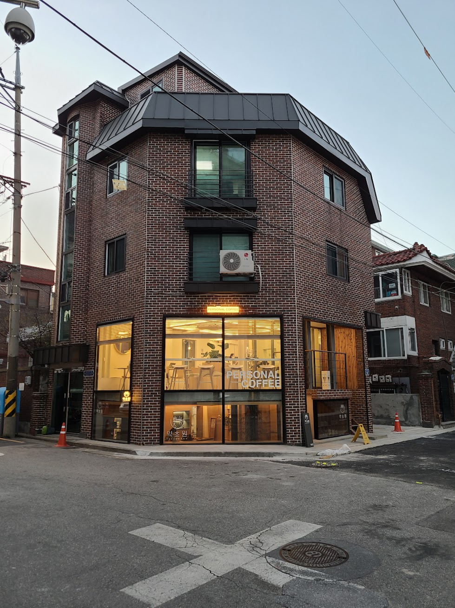

## 문제 1

Q: 다음 이미지에 대한 설명 중 옳지 않은 것은 무엇인가요?
- (1) 이 행사장은 대형 실내 컨퍼런스 홀로, 많은 사람들이 노트북을 사용하고 있습니다.
- (2) 무대 앞에 큰 디스플레이 화면이 있고, “DIVE 2024” 포스터가 걸려 있습니다.
- (3) 천장에는 밝은 조명과 노출된 금속 빔이 보입니다.
- (4) 벽의 한쪽에 초록색 벽지가 붙어 있습니다.

Listening: Which of the following descriptions of the image is incorrect?
- (1) It shows a large indoor conference hall with many people using laptops.
- (2) There is a large display screen in front of the stage and posters reading "DIVE 2024."
- (3) The ceiling has bright lighting and exposed metal beams.
- (4) One wall has green wallpaper.

정답: (4) 벽의 한쪽에 초록색 벽지가 붙어 있습니다.

---------------------

## 문제 2

Q: 다음 이미지에 대한 설명 중 옳지 않은 것은 무엇인가요?
- (1) 전경에 밝은 노란색 조각상이 보입니다.
- (2) 배경에 창이 많은 베이지색 건물이 있습니다.
- (3) 건물의 간판에 Local Stitch라고 적혀 있습니다.
- (4) 구내를 걷는 사람들이 있습니다.

Listening: Which of the following descriptions of the image is incorrect?
- (1) It shows a bright yellow sculpture in the foreground.
- (2) A beige building with many windows is in the background.
- (3) The sign on the building reads Local Stitch.
- (4) There are people walking in the courtyard area.

정답: (4) 구내를 걷고 있는 사람들이 보이지 않으며, 4번 설명은 옳지 않습니다.

---------------------

## 문제 3

Q: 다음 이미지에 대한 설명 중 옳지 않은 것은 무엇인가요?
- (1) 이곳은 긴 스테인리스 카운터가 있는 커피숍이다.
- (2) 카운터 뒤편에는 노란 벽 패널이 있다.
- (3) 왼쪽 벽에 책과 잡지가 진열된 선반이 있다.
- (4) 전면의 의자는 빨간색이다.

Listening: Which of the following descriptions of the image is incorrect?
- (1) It is a coffee shop with a long stainless steel counter.
- (2) There is a bright yellow panel behind the counter.
- (3) There are shelves with books and magazines along the left wall.
- (4) The chairs in front are red.

정답: (4) 전면의 의자는 빨간색이 아니다.
(주의: 정답은 1~4 중 하나만 선택되도록 출제하세요.)

---------------------

## 문제 4

Q: 다음 이미지에 대한 설명 중 옳지 않은 것은 무엇인가요?
- (1) 1층에 커피숍이 운영되고 있습니다.
- (2) 건물의 외벽은 붉은 벽돌로 되어 있습니다.
- (3) 건물 앞에는 주황색 안전콘이 설치되어 있습니다.
- (4) 지붕은 파란색으로 칠해져 있습니다.

Listening: Which of the following descriptions of the image is incorrect?
- (1) There is a coffee shop on the first floor.
- (2) The exterior walls of the building are made of red brick.
- (3) Orange safety cones are installed in front of the building.
- (4) The roof is painted blue.

정답: (4) 지붕은 파란색으로 칠해져 있습니다.
(주의: 정답은 1~4 중 하나만 선택되도록 출제하세요.)

---------------------

## 문제 5

다음 이미지를 바탕으로 두 문제를 만들었습니다. 각 문제의 정답은 1~4 중 하나로만 택해 주시고, 토익 리스ニング 스타일로 구성했습니다.

----- 문제 1 -----
Q: 다음 이미지에 대한 설명 중 옳지 않은 것은 무엇인가요?
- (1) 진열대 위에는 다양한 빵들이 놓여 있습니다.
- (2) 카운터 뒤에 직원 두 명이 서 있습니다.
- (3) 점원 중 한 명은 빨간 모자를 쓰고 있습니다.
- (4) 매장 안쪽에 흰색 벽과 선반이 보입니다.

Listening: Which of the following descriptions of the image is incorrect?
- (1) There are various breads placed on the display.
- (2) Two staff members are standing behind the counter.
- (3) One of the clerks is wearing a red cap.
- (4) Inside the shop, a white wall and shelves are visible.

정답: (3) 점원 중 한 명은 빨간 모자를 쓰고 있습니다. (실제로 점원은 흰색 계열 모자를 쓰고 있습니다.)

----- 문제 2 -----
Q: 다음 이미지에 대한 설명 중 옳지 않은 것은 무엇인가요?
- (1) 빵들이 진열대에 다양하게 놓여 있습니다.
- (2) 각 빵 위에는 가격표가 붙어 있습니다.
- (3) 매장 안쪽에 직원이 보이는 모습이 있습니다.
- (4) 빵은 색상과 크기가 다양하게 배치되어 있습니다.

Listening: Which of the following descriptions of the image is incorrect?
- (1) The breads are displayed in a variety on the display shelves.
- (2) Each bread has a price tag attached.
- (3) There is a staff member visible inside the shop.
- (4) The breads come in many shapes and colors.

정답: (3) 매장 안쪽에 직원이 보이는 모습이 있습니다. (실제로 사진에는 직원이 보이지 않습니다.)

---------------------

## 문제 6

----- 예시 -----

Q: 다음 이미지에 대한 설명 중 옳지 않은 것은 무엇인가요?
- (1) 여러 남자들이 가게 앞에서 공사를 하고 있다.
- (2) 건물의 간판은 초록색 바탕에 영어로 "bakery cafe pomme verte"가 적혀 있다.
- (3) 왼쪽에는 빨간 간판이 있어 전화번호가 보인다.
- (4) 점원이 노란색 셔츠를 입고 있다.

Listening: Which of the following descriptions of the image is incorrect?
- (1) Several men are working on construction in front of shops.
- (2) The storefront sign has a green background and reads "bakery cafe pomme verte" in English.
- (3) On the left, there is a red sign with a visible phone number.
- (4) The clerk is wearing a yellow shirt.

정답: (4) 점원은 노란색 셔츠가 아닌 파란색 셔츠를 입고 있습니다.

---------------------

## 문제 7

Q: 다음 이미지에 대한 설명 중 옳지 않은 것은 무엇인가요?
- (1) 이 공간은 넓은 카페로, 사람들이 테이블에 앉아 대화하고 있습니다.
- (2) 천장이 검은 색 트랙 조명으로 가늘게 늘어서 두세 줄로 배치되어 있습니다.
- (3) 벽면에 큰 창문이 있어 밖이 보이고 실내에 자연광이 많이 들어옵니다.
- (4) 무대가 설치되어 있어 공연이 열리고 있습니다.

Listening: Which of the following descriptions of the image is incorrect?
- (1) This space is a large cafe where people are seated at tables and talking.
- (2) The ceiling has black track lighting arranged in narrow rows.
- (3) There are large windows on the walls, letting in a lot of natural light.
- (4) There is a stage for performances.

정답: (4) 무대가 설치되어 있어 공연이 열리고 있습니다.
(설명: 사진에는 무대가 보이지 않고 일반 카페 공간이며, 천장에 다양한 방향의 조명이 있지만 공연용 무대는 없습니다.)

---------------------

## 문제 8

Q: 다음 이미지에 대한 설명 중 옳지 않은 것은 무엇인가요?
- (1) 버스 앞에 사람들이 줄 서서 기다리고 있다.
- (2) 건물 옆에 가로수들이 일렬로 심어져 있다.
- (3) 창 밖에 거대한 글자들이 보인다.
- (4) 오늘은 맑고 햇살이 강하게 비친다.

Listening: Which of the following descriptions of the image is incorrect?
- (1) There are people standing in a line in front of the bus.
- (2) Trees are planted along the building in a row.
- (3) Large letters are visible on the window glass outside.
- (4) It is sunny and bright today.

정답: (1) 버스 앞에 사람들이 줄 서서 기다리고 있다.
(설명: 사진 속 사람들은 버스 앞에 모여 있지만 명확한 줄 서기는 보이지 않으며 군집 형태로 서 있습니다.)

---------------------

