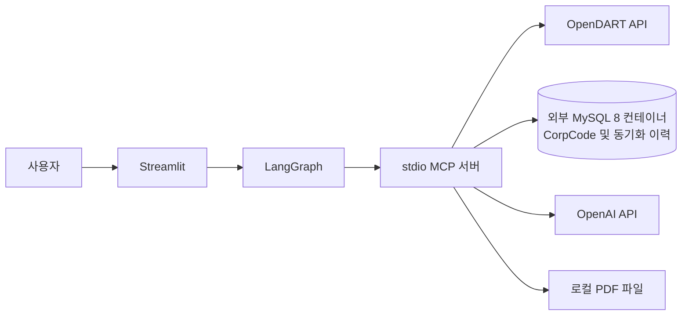

# OpenDART 재무 상담 앱

Streamlit에서 기업명을 입력하면 LangGraph 에이전트가 MCP 도구를 통해 OpenDART 재무자료를 조회하고, 결과를 한국어로 설명하는 프로젝트입니다. 사용자가 요청하면 재무 상담 내용을 읽기 쉬운 PDF로 생성해 화면에서 내려받을 수 있습니다.

## 주요 기능

- OpenDART 기업 고유번호(CorpCode)로 기업을 찾아 재무자료와 주요 지표 조회
- Streamlit 대화 화면에서 설명 수준을 선택해 재무 질문
- LangGraph 에이전트와 stdio MCP 도구 연결
- 요청 시 재무 상담 PDF 생성 및 다운로드
- MySQL에 CorpCode 마스터와 동기화 이력 저장

MySQL은 프로젝트와 별도로 실행되는 **사용자 관리 MySQL 8 Docker 컨테이너**를 사용. 저장소에 MySQL Dockerfile 또는 Compose 파일은 없습니다. 이 앱은 조회한 재무제표나 대화 이력을 MySQL에 저장하지 않는다. B2B 제안서·CRM 기능도 현재 프로젝트 범위에 포함되지 않습니다.

## 빠른 시작

자세한 MySQL 컨테이너 설정, 데이터베이스 및 테이블 준비, `.env` 구성, 실행 절차는 [실행·환경 설정 안내서](src/md_dir/run_environment_guide.md)를 참고.

요약하면 프로젝트 루트에서 다음을 수행.

```bash
python3.12 -m venv .venv
source .venv/bin/activate
python -m pip install -r src/requirements.txt
streamlit run src/app/streamlit_app.py
```

실행 전, 프로젝트 루트 `.env`에 `OPENAI_API_KEY`, `DART_API_KEY`(또는 `OPENDART_API_KEY`), `CORP_CODE_DATABASE_URL`을 설정.

## 저장소 구성

```text
src/
├── app/                 # Streamlit, LangGraph, MCP, OpenDART, PDF, CorpCode 동기화
├── sql/                 # MySQL CorpCode DDL 및 레거시 SQLite DDL
├── tests/               # 오프라인 단위 테스트
├── requirements.txt     # Python 의존성
├── md_dir/              # 설계·요구사항·환경·테스트 문서
└── README.md            # 앱 모듈 설명
```

주요 실행 파일은 `src/app/streamlit_app.py`이며, Python 의존성은 `src/requirements.txt`에서 관리. 테스트/기능 점검 스크립트인 `src/test_callImportant.sh`는 OpenDART와 MySQL에 실제 연결할 수 있으므로 실행 시 외부 API 및 DB 사용에 유의. 이전 테스트 기록과 검증 한계는 테스트 계획 및 결과서에 정리 됨.

## 문서

| 문서 | 내용 |
| --- | --- |
| [실행·환경 설정 안내서](src/md_dir/run_environment_guide.md) | Python, `.env`, MySQL 8 Docker, DB·테이블 생성, 앱 실행 |
| [시스템 설계서](src/md_dir/system_design.md) | 구성요소, 시스템 경계, 흐름 다이어그램 |
| [요구사항 정의서](src/md_dir/requirements_definition.md) | 현재 시스템 범위와 기능·비기능 요구사항 |
| [데이터·API 설계서](src/md_dir/data_api_design.md) | CorpCode 데이터와 OpenDART API 설계 |
| [테스트 계획 및 결과서](src/md_dir/test_plan_and_results.md) | 테스트 유형, 과거 실행 결과, 미검증 항목 |
| [생명주기 설명서](src/md_dir/lifecycle.md) | 현재 DB 연결 생명주기와 개선 방향 |
| [문제점 기록](src/md_dir/problem.md) | 코드 리뷰에서 확인한 문제 및 후속 과제 |
| [기존 앱 README](src/README.md) | 앱 모듈과 MCP 도구에 대한 간단한 설명 |

## 현재 아키텍처 한눈에 보기



## 테스트

오프라인 단위 테스트는 가상환경에 테스트 의존성을 설치한 뒤 실행합니다.

```bash
python -m pytest src/tests/test_financial_chatbot.py
```

실제 OpenDART·MySQL 호출이 포함된 쉘 스크립트는 별도 통합 점검입니다. 테스트 범위와 과거 결과를 먼저 [테스트 계획 및 결과서](src/md_dir/test_plan_and_results.md)에서 확인하세요. 이전 결과는 현재 코드에서 다시 실행한 결과와 구분해 기록되어 있습니다.
