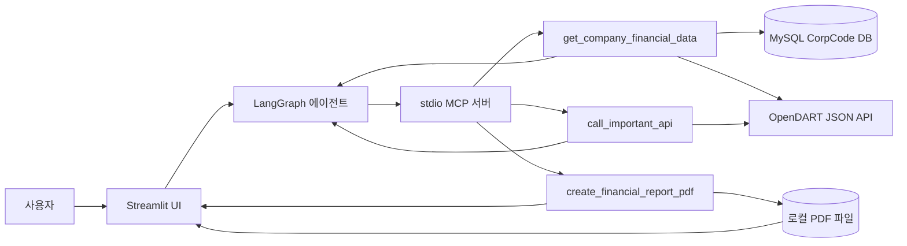

# 데이터·API 설계서

## 1. 문서 목적과 범위

이 문서는 현재 `src/app` OpenDART 재무 상담 앱의 데이터 저장 구조, 외부 API 연동, MCP 도구 계약, PDF 산출 데이터 흐름을 코드 기준으로 정리한다. 확인된 구현과 보완 제안을 구분하며, 환경변수의 실제 값이나 인증키는 기록하지 않는다.

### 범위에 포함되는 구성요소

- Streamlit 대화 UI와 LangGraph 에이전트
- stdio 전송을 사용하는 MCP 서버와 도구
- OpenDART API 클라이언트 및 응답 정규화
- MySQL에 저장하는 CorpCode 마스터와 동기화 이력
- 재무 상담 결과를 저장하는 PDF 파일

재무 조회 응답을 MySQL에 장기 저장하거나, 대화 이력을 별도 DB에 저장하는 기능은 현재 구현 범위에 포함되지 않는다.

## 2. 구성과 데이터 흐름



1. 사용자가 회사를 입력하면 에이전트가 재무 조회 MCP 도구를 호출한다.
2. 재무 조회는 MySQL에서 회사명에 대응하는 DART `corp_code`를 찾고 OpenDART에서 보고서와 재무 응답을 받는다.
3. 정규화된 값과 원본 API 응답을 에이전트에 반환한다. 재무 응답 자체는 현재 MySQL에 적재하지 않는다.
4. 사용자가 PDF 요약을 요청하면 에이전트가 요약, 지표, 유의사항, 출처를 PDF MCP 도구에 전달한다.
5. PDF 도구는 파일을 로컬 보고서 디렉터리에 저장하고 `PDF_READY` 토큰을 돌려준다. Streamlit은 토큰에서 보고서 ID를 읽어 다운로드 버튼을 제공한다.

## 3. 데이터 저장 설계

### 3.1 MySQL에 저장되는 데이터

MySQL은 기업명으로 DART 기업 고유번호를 찾기 위한 CorpCode 저장소다. 기본 연결 문자열은 `CORP_CODE_DATABASE_URL` 환경변수에서 읽으며, `mysql://` 및 `mysql+pymysql://` 형식은 비동기 드라이버 URL인 `mysql+asyncmy://`로 변환된다. 연결 주소는 앱의 실행 위치와 Docker 네트워크 구성에 맞춰 지정해야 한다.

| 테이블 | 용도 | 주요 컬럼 |
|---|---|---|
| `dart_corp_codes` | 현재 유효한 기업 고유번호 마스터 | `corp_code` PK, `corp_name`, `corp_eng_name`, `stock_code`, `modify_date`, `is_active`, `last_seen_at`, `updated_at` |
| `dart_corp_code_sync_runs` | 내려받은 CorpCode 원본별 동기화 요약 | `id` PK, `fetched_at`, `source_sha256`, `source_record_count`, `inserted_count`, `changed_count`, `retired_count` |

`corp_code`는 8자리 DART 기업 고유번호이며, `stock_code`는 최대 6자리 종목코드다. 둘은 서로 다른 식별자이므로 대체해서 사용하지 않는다.

### 3.2 CorpCode 동기화와 검색

- 동기화는 `corpCode.xml` API의 ZIP 응답을 내려받고 ZIP 내부 XML에서 기업 레코드를 읽는다.
- 다운로드 원본의 SHA-256이 직전 동기화와 같고 DB에 기존 레코드가 있으면 쓰기를 생략한다.
- 변경된 원본은 새 기업 삽입, 기존 기업 정보 갱신, 원본에서 사라진 기업의 `is_active=False` 처리를 수행한다.
- MySQL named lock으로 동시에 둘 이상의 CorpCode 동기화 작업이 쓰기 작업을 진행하지 않도록 한다.
- 동기화 요약에는 원본 해시와 입력·삽입·변경·비활성화 레코드 수를 남긴다. 전체 OpenDART 재무 응답은 이 테이블에 저장하지 않는다.
- 회사명 검색은 활성 레코드 중 완전 일치부터 찾고, 없으면 부분 일치로 검색한다. 후보가 없거나 여러 개면 조회 흐름에서 오류를 반환한다.

### 3.3 현재 저장되지 않는 데이터

| 데이터 | 현재 처리 | 영속 저장 여부 |
|---|---|---|
| OpenDART 재무제표·재무지표 응답 | 원본과 정규화 값을 MCP 결과로 반환 | MySQL에 저장하지 않음 |
| 대화 메시지 | Streamlit `session_state`에서 화면 세션 동안 유지 | 앱 DB에 저장하지 않음 |
| PDF 보고서 | `FINANCIAL_REPORT_DIR` 또는 기본 `src/data/reports/`에 파일로 저장 | 로컬 파일로 저장, MySQL에 저장하지 않음 |
| API 인증키 | 환경변수에서 읽음 | DB·보고서에 저장하지 않음 |

PDF의 저장 파일명은 UUID 기반이며, 다운로드 시 회사명과 짧은 ID를 포함한 표시 파일명을 별도로 사용한다. PDF 파일과 로컬 DB·런타임 데이터는 저장소에 커밋하지 않는다.

## 4. OpenDART API 설계

### 4.1 공통 호출 규칙

| 항목 | 구현 |
|---|---|
| 기본 주소 | `https://opendart.fss.or.kr/api` |
| HTTP 방식 | `httpx.AsyncClient` 기반 비동기 GET |
| 인증 | `crtfc_key` 요청 파라미터에 자동 추가 |
| 인증키 환경변수 | `DART_API_KEY` 우선, 없으면 `OPENDART_API_KEY` |
| 성공 판정 | HTTP 오류 확인 후 JSON 응답의 `status == "000"` 확인 |
| 재무 요청 공통 식별자 | 8자리 `corp_code`, 4자리 `bsns_year`, `reprt_code` |
| 재무제표 구분 | `CFS` 연결, `OFS` 별도 |
| 보고서 코드 | 1분기 `11013`, 반기 `11012`, 3분기 `11014`, 사업보고서 `11011` |

HTTP 클라이언트 기본 타임아웃은 30초이며 클라이언트 인스턴스당 최대 연결 수는 20이다. 현재 MCP 도구는 API 호출용 클라이언트를 열고 도구 호출을 마치면 닫는다.

### 4.2 재무 조회에서 사용하는 API

| 순서 | 엔드포인트 | 목적 | 주요 요청 값 |
|---|---|---|---|
| 1 | MySQL CorpCode 검색 | 회사명에서 `corp_code` 결정 | `company_name` |
| 2 | `list.json` | 정기보고서 및 접수번호 검색 | `corp_code`, 날짜 구간, 페이지 |
| 3 | `fnlttSinglAcnt.json` | 주요 재무계정 | `corp_code`, `bsns_year`, `reprt_code` |
| 4 | `fnlttSinglIndx.json` | 재무지표 분류별 조회 | 공통 식별자, `idx_cl_code` |
| 5 | `fnlttSinglAcntAll.json` | 전체 재무제표 | 공통 식별자, `fs_div` |
| 6 | `company.json` | 기업 개황 | `corp_code` |

재무지표 분류는 수익성 `M210000`, 안정성 `M220000`, 성장성 `M230000`, 활동성 `M240000`이다. 보고서 1건을 조회할 때 주요계정 1회, 지표 4회, 전체 재무제표 1회가 병렬 수집되고, 기업 개황도 조회한다.

현재 정기보고서 선택 코드는 2015년부터 오늘까지의 `list.json` 결과에서 첫 페이지 100건만 요청하고, 보고서명에서 보고서 코드를 판별한다. 같은 사업연도·보고서 유형에 정정본이 여러 개면 접수번호가 가장 큰 레코드를 유지한다.

### 4.3 추가 API 호출 경로

`call_important_api(endpoint, params)` MCP 도구는 JSON 응답 API를 직접 호출한다. `corpCode.xml`, `document.xml`, `fnlttXbrl.xml` 등 바이너리 ZIP API는 `OpenDartImportantClient` 내부 메서드가 제공하지만, 현재 MCP 도구로 직접 노출되지는 않는다.

클라이언트는 엔드포인트를 파일명 문자 집합으로 검증하지만 사전 정의된 허용 목록을 강제하지는 않는다. 운영 환경에서는 이 도구의 허용 엔드포인트와 요청 파라미터 범위를 별도로 제한하는 것이 안전하다.

## 5. API 응답 및 정규화 데이터 계약

### 5.1 재무 조회 MCP 도구

요청 필드:

| 필드 | 타입 | 기본값 | 규칙 |
|---|---|---|---|
| `company_name` | 문자열 | 필수 | CorpCode DB에서 검색할 회사명 |
| `history_count` | 정수 | `1` | 1 이상. 현재 최대값 제한은 없음 |
| `fs_div` | 문자열 | `CFS` | `CFS` 또는 `OFS` |

도구 응답은 JSON 문자열이며 최상위 구조는 다음과 같다.

```json
{
  "company": { "corp_code": "...", "corp_name": "..." },
  "company_detail": { "status": "000", "...": "OpenDART company.json 원본 필드" },
  "reports": [
    {
      "report": { "bsns_year": "...", "reprt_code": "...", "rcept_no": "..." },
      "accounts": { "...": "fnlttSinglAcnt 원본 응답" },
      "indices": {
        "profitability": { "...": "원본 응답" },
        "stability": { "...": "원본 응답" },
        "growth": { "...": "원본 응답" },
        "activity": { "...": "원본 응답" }
      },
      "accounts_all": { "...": "fnlttSinglAcntAll 원본 응답" },
      "normalized_accounts": [],
      "normalized_indices": {},
      "source": {}
    }
  ]
}
```

API 원본 응답을 보존하면서 모델 입력용 정규화 목록을 함께 전달한다. 금액·지표의 원본 문자열과 수치 변환 가능 여부를 함께 유지해, 결측을 0으로 오인하지 않도록 한다.

### 5.2 정규화 계정

각 `normalized_accounts` 항목은 다음 정보를 가진다.

| 필드 | 설명 |
|---|---|
| `account_id`, `account_nm`, `account_detail` | OpenDART 계정 식별자와 표시 정보 |
| `sj_div` | 재무제표 구분(예: BS, IS, CIS, CF, SCE) |
| `fs_div` | 연결·별도 구분 |
| `amount`, `amount_raw`, `amount_available` | 변환 값, 원본 문자열, 숫자 사용 가능 여부 |
| `amount_field`, `currency` | 선택된 OpenDART 금액 필드와 통화 |
| `source` | 기업·사업연도·보고서·접수번호·기준일 등 출처 메타데이터 |

현재 금액 필드 선택은 재무제표 구분, 보고서 유형에 따른 규칙을 사용한다. 다만 반기 현금흐름표에서 선택된 누적 필드가 응답에 없어 값이 누락되는 사례가 `problem.md`에 기록돼 있다. 이 규칙은 기간·계정 종류별 검증 후 보완해야 한다.

### 5.3 정규화 지표와 출처

각 `normalized_indices` 항목은 지표 분류·코드·이름, 수치값, 원본 값, 사용 가능 여부, 기준일, 출처 메타데이터를 보유한다. `source`에는 다음 공통 정보를 기록한다.

`corp_code`, `corp_name`, `bsns_year`, `reprt_code`, `report_nm`, `rcept_no`, `rcept_dt`, `fs_div`, `stlm_dt`

이 필드는 응답이 어느 회사·보고서·접수번호·연결 기준에서 왔는지 재현하는 데 사용한다. 현재 PDF 생성 도구는 에이전트가 구성한 출처 문자열을 받지만, PDF에 적힌 숫자와 OpenDART 원본 응답을 자동 대조하지 않는다.

## 6. MCP 도구 계약

| 도구 | 입력 | 출력 및 부작용 |
|---|---|---|
| `get_company_financial_data` | `company_name`, `history_count`, `fs_div` | OpenDART 원본 및 정규화 데이터를 JSON 문자열로 반환. CorpCode DB를 읽음 |
| `call_important_api` | `endpoint`, 선택 `params` | OpenDART JSON 응답을 JSON 문자열로 반환 |
| `create_financial_report_pdf` | `company_name`, `report_period`, `executive_summary`, `financial_analysis`, `key_metrics`, `caveats`, `sources` | PDF 파일을 로컬 디렉터리에 생성하고 `PDF_READY:<report_id>:<filename>` 형식 토큰을 반환 |

PDF 지표는 한 줄마다 `지표명 | 현재값과 단위 | 비교값과 비교 기간` 형태가 권장된다. 비교값이 확인되지 않으면 생략하며, PDF 도구는 전달받은 텍스트를 배치할 뿐 숫자의 원본 진위나 계산을 검증하는 서비스는 아니다.

## 7. 환경 설정과 비밀정보

| 환경변수 | 목적 |
|---|---|
| `OPENAI_API_KEY` | LangChain OpenAI 모델 인증 |
| `DEFAULT_LLM_MODEL` | 사용할 모델. 미설정 시 코드 기본값 사용 |
| `DART_API_KEY` | OpenDART 인증키 우선 환경변수 |
| `OPENDART_API_KEY` | `DART_API_KEY`가 없을 때 사용하는 대체 환경변수 |
| `CORP_CODE_DATABASE_URL` | CorpCode MySQL 연결 문자열 |
| `FINANCIAL_REPORT_DIR` | PDF 저장 위치 선택값. 미설정 시 `src/data/reports/` |

`.env`의 실제 값은 이 문서나 Git에 기록하지 않는다. 운영 로그에서도 URL 쿼리의 `crtfc_key`가 출력되지 않도록 마스킹 또는 HTTP 요청 로그 정책을 확인해야 한다.

## 8. 데이터베이스 스키마와 기존 SQL 문서의 주의점

- 실제 SQLAlchemy 모델은 `src/app/corp_code_sync.py`의 `CorpCode`, `CorpCodeSyncRun`이다.
- CorpCode 동기화 시 `Base.metadata.create_all()`을 호출해 모델의 테이블을 생성한다. 별도 버전 관리형 마이그레이션은 현재 확인되지 않는다.
- `src/sql/corp_code.sql`은 MySQL용 DDL이며 컬럼·인덱스와 테이블 식별을 점검할 때 참고한다. ORM 모델과 DDL 사이에 `CHAR`/`VARCHAR`, 동기화 이력 `id` 타입, 보조 인덱스 차이가 있으므로 하나를 기준 스키마로 정하고 일치시켜야 한다.
- `src/sql/schema.sql`은 `companies`와 `financial_reports`를 정의하는 구형 SQLite 스타일 DDL(`AUTOINCREMENT`)이다. 현재 OpenDART 앱의 ORM 모델이나 MySQL CorpCode 저장 구조를 설명하는 기준 문서가 아니므로, 현재 MySQL 컨테이너에 그대로 적용하지 않는다.

## 9. 현재 확인된 제한사항과 후속 설계 과제

1. **보고서 검색 페이지 제한:** 현재 첫 페이지 100건만 검색하므로 요청 이력이 늘어나면 필요한 과거 정기보고서를 놓칠 수 있다. 요청 개수를 확보할 때까지 페이지를 넘기되 상한을 두는 정책이 필요하다.
2. **요청 개수 상한 부재:** `history_count`는 1 이상만 검사한다. 보고서 한 건마다 주요계정·전체계정·4개 재무지표 API 호출이 발생하므로 최대 이력 수와 동시 호출량을 제한해야 한다.
3. **금액 필드 정규화:** 반기 현금흐름 사례에서 현재 선택 필드가 비어 값이 사라지는 문제가 기록돼 있다. 보고서·재무제표 종류별 금액 필드와 기간 의미를 검증해야 한다.
4. **보고서 근거 대조:** PDF 생성 전에 사용된 숫자·단위·기간·접수번호를 원본 응답과 대조하는 검증 단계가 없다.
5. **MySQL 연결 풀 재사용:** 회사명 검색 때마다 엔진·세션 팩토리를 만들고 조회 후 엔진을 폐기한다. 풀 설정은 해당 호출 범위 안에만 유효하므로 지속 실행 서비스의 생명주기 관리가 후속 과제다. 자세한 설명은 [`lifecycle.md`](lifecycle.md)를 참고한다.
6. **CorpCode 스키마 관리:** 모델의 테이블 생성은 있으나 스키마 변경의 버전·롤백을 관리할 마이그레이션 도구가 확인되지 않는다. ORM과 MySQL DDL의 컬럼·인덱스 차이를 정리해야 한다.
7. **API 요청 도구의 허용범위:** 범용 JSON API 도구는 파일명 문법만 검증한다. 제품 운영 시 도구에서 허용할 엔드포인트·파라미터를 명시해야 한다.
8. **인증키 로그 노출:** `problem.md`에 요청 URL 로그에 OpenDART 인증키 쿼리값이 출력된 사례가 기록돼 있다. 요청 로그에서 해당 값을 제거하고 실제 운영 로그 정책을 검증해야 한다.

## 10. 관련 코드와 문서

- [`app/corp_code_sync.py`](app/corp_code_sync.py): MySQL ORM, 연결 문자열, CorpCode 검색·동기화
- [`app/callImportantAPI.py`](../app/callImportantAPI.py): OpenDART 엔드포인트, API 호출, 재무 응답 조합·정규화
- [`app/mcp_tools.py`](app/mcp_tools.py): 모델에 노출되는 MCP 요청·응답 계약
- [`app/pdf_report.py`](app/pdf_report.py): PDF 입력 필드와 파일 저장
- [`app/agent.py`](app/agent.py), [`app/streamlit_app.py`](app/streamlit_app.py): 호출 흐름과 UI 세션
- [`corp_code.sql`](sql/corp_code.sql): MySQL CorpCode DDL
- [`APIList.md`](APIList.md), [`ImportantList.md`](ImportantList.md): OpenDART API 참고 목록
- [`lifecycle.md`](lifecycle.md), [`problem.md`](problem.md): 연결 수명주기 및 확인된 문제
