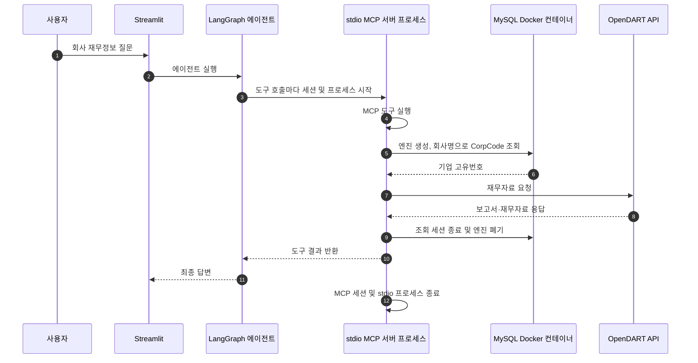
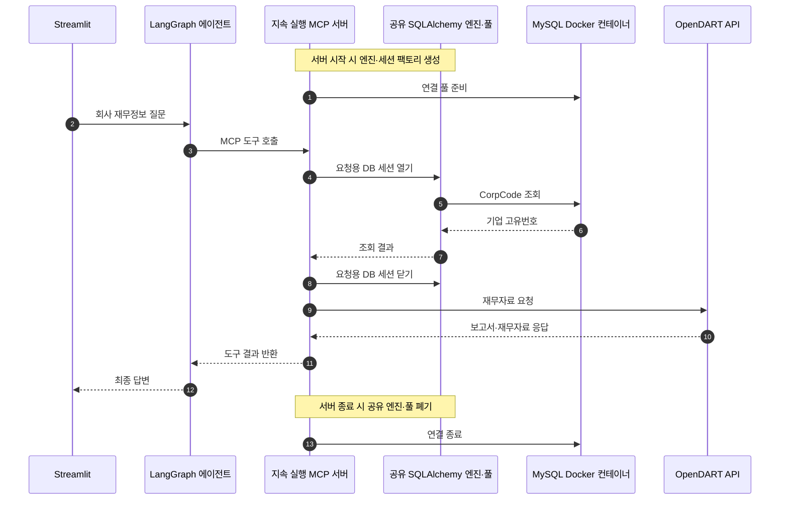

# 애플리케이션과 MySQL 연결 수명주기

## 현재 구조

Streamlit은 LangGraph 에이전트를 캐시하지만, 에이전트의 MCP 도구는 stdio로 연결됩니다. LangChain `MultiServerMCPClient.get_tools()`의 기본 도구 호출은 MCP 세션마다 새 연결을 열며, stdio 연결은 별도 서버 프로세스를 시작합니다. 따라서 Streamlit에 에이전트가 캐시되어도 MCP 서버나 그 안의 MySQL 엔진이 캐시되는 것은 아닙니다.

### 현재 구조의 문제

`corp_code_sync.py`는 MySQL 엔진과 세션 팩토리를 만들고 회사 조회가 끝나면 엔진을 폐기합니다. 그 조회가 실행되는 MCP 프로세스도 도구 호출 후 종료되므로, 다음 도구 호출은 새 프로세스와 새 엔진을 만듭니다. `pool_size` 등 커넥션 풀 설정을 해도 조회 간에 연결을 재사용하지 못합니다.

세션과 엔진은 종료 경로에서 정리되므로 핵심 문제는 연결 누수가 아니라 생성·폐기 비용과 풀 재사용의 부재입니다. 현재 트래픽이 적다면 기능 오류 없이 동작할 수 있지만, 반복 조회나 동시 사용에서는 비효율적입니다.

### 사용량이 늘 때의 영향과 후속 보완

이 문제는 사용자가 많아져야만 나타나는 것은 아닙니다. 현재는 회사 재무 조회 도구를 한 번 실행할 때도 엔진 생성과 조회 후 폐기가 반복됩니다. 사용자가 적으면 이 비용이 작아 눈에 띄지 않을 수 있습니다.

SQLAlchemy 엔진은 연결 풀을 관리하는 객체이며, 엔진 생성 자체가 MySQL TCP 연결을 즉시 여는 것은 아닙니다. 실제 연결은 조회가 실행될 때 열립니다. 하지만 각 MCP 도구 실행이 별도 프로세스라서 다른 호출이 사용할 풀은 남지 않습니다. 여러 요청이 겹치면 각 프로세스가 각각 연결을 열 수 있으므로 짧은 시간 동안 MySQL 연결 수가 늘고, 연결 초기화 시간과 DB 자원 사용량도 증가할 수 있습니다. `pool_size=10`은 프로세스마다 만들어지는 풀의 설정이지, 모든 MCP 프로세스가 공유하는 전역 연결 상한은 아닙니다.

이 동작은 현재 확인 범위에서 연결 누수를 뜻하지 않습니다. 각 조회 뒤 세션과 엔진을 정리합니다. 다만 사용량이 낮을 때 괜찮다는 이유로 증가 상황까지 해결됐다고 볼 수는 없습니다. **지속 실행 MCP 서버와 서버 수명 DB 풀로 바꾸는 일은 후속 보완 항목으로 남깁니다.** 그때 동시 요청에서의 연결 수와 응답 시간을 확인하고, 실제 부하에 맞춰 풀 크기를 정해야 합니다.

## 권장 구조: 지속 실행 MCP 서버와 서버 수명 DB 풀

MCP 서버를 지속 실행하고, 서버 시작 시 MySQL 엔진과 세션 팩토리를 한 번 생성합니다. 각 도구 호출은 공용 세션 팩토리로 요청 단위 세션을 열고 닫으며, 서버 종료 때 공유 엔진을 폐기합니다. Streamlit은 stdio 하위 프로세스를 도구마다 띄우는 대신 지속 실행 MCP 서버에 연결합니다.

### 장점과 단점

| 장점 | 단점 |
| --- | --- |
| 여러 도구 호출에서 MySQL 연결 풀을 재사용해 연결 초기화 비용을 줄입니다. | MCP 서버를 별도 프로세스나 컨테이너로 계속 실행해야 합니다. |
| 서버 시작과 종료가 DB 자원의 생성·정리를 맡아 책임이 명확합니다. | 서버 준비 상태, 재시작, 포트, 접근 보호를 운영해야 합니다. |
| 요청마다 세션은 분리하면서 엔진과 풀은 공유할 수 있습니다. | Streamlit과 MCP 사이의 전송 구성을 추가해야 합니다. |

MCP 서버의 lifespan은 서버 시작·종료에 맞춰 자원을 준비하고 정리하는 용도입니다. 단, 현재처럼 stdio 클라이언트가 도구 호출마다 새 MCP 서버 프로세스를 실행하면 lifespan도 매 호출마다 실행됩니다. 풀을 재사용하려면 서버 프로세스가 실제로 지속되어야 합니다.

## 대안: stdio 세션을 지속 유지

별도 MCP 서비스를 띄우지 않고, Streamlit 프로세스에서 stdio 클라이언트와 세션을 앱 수명 동안 유지할 수도 있습니다. 이 경우 MCP 서버의 DB 풀은 지속되지만, 현재 Streamlit 코드의 `asyncio.run()`은 호출마다 이벤트 루프를 만들고 닫기 때문에 세션·이벤트 루프·정리 시점을 함께 재설계해야 합니다. 사용자별 세션 격리와 동시 요청 처리도 확인해야 합니다.

| 장점 | 단점 |
| --- | --- |
| 별도 HTTP MCP 서비스나 컨테이너를 추가하지 않아도 됩니다. | Streamlit과 비동기 세션의 수명 관리가 복잡해집니다. |
| 기존 stdio MCP 도구 구성을 유지할 수 있습니다. | Streamlit 재실행·사용자별 상태·동시 호출에서 세션을 안전하게 관리해야 합니다. |

## 코드 기준 연결 지점

- `app/streamlit_app.py`: 캐시된 에이전트를 만들고 사용자 입력마다 실행합니다.
- `app/agent.py`: stdio MCP 연결을 설정하고 도구를 LangGraph에 등록합니다.
- `app/mcp_server.py`: MCP 서버의 실행 진입점입니다.
- `app/mcp_tools.py`: 재무 조회 MCP 도구에서 `callImportantAPI.py`를 호출합니다.
- `app/callImportantAPI.py`: 회사명 조회 후 OpenDART 데이터를 수집합니다.
- `app/corp_code_sync.py`: MySQL 엔진·세션을 만들고 CorpCode 조회 및 동기화를 수행합니다.

## 참고

- [LangChain MCP 어댑터의 `MultiServerMCPClient`](https://github.com/langchain-ai/langchain-mcp-adapters/blob/main/langchain_mcp_adapters/client.py): 기본 `get_tools()` 방식의 도구별 세션과 명시적 세션 사용 예시.
- [MCP Python SDK의 lifespan 안내](https://github.com/modelcontextprotocol/python-sdk/blob/main/docs/handlers/lifespan.md): 서버 시작 시 자원을 만들고 서버 종료 시 정리하며, 서버 실행 중 핸들러가 공유하는 방식.
