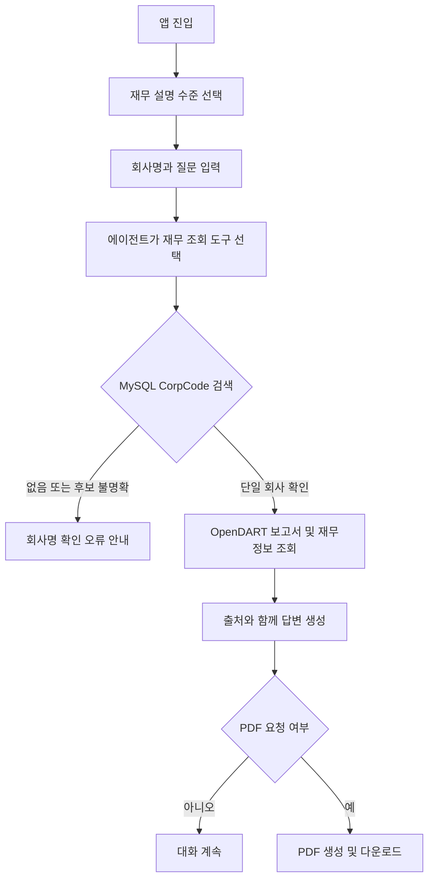

# OpenDART 재무 상담 앱 요구사항 정의서

## 1. 문서 목적

현재 저장소의 Streamlit·LangGraph·MCP·OpenDART·MySQL 기능을 바탕으로 제품 범위와 요구사항을 정의한다. 아래 요구사항은 코드에서 확인된 현재 동작과, 안정적인 인수 기준을 위해 필요한 목표를 구분한다.

**구현 상태**는 코드 정적 검토 기준이다. `구현` 표기는 실제 운영 환경에서 모든 조건이 검증되었다는 뜻이 아니며, 테스트 코드가 있더라도 실행 결과를 별도로 확인해야 한다.

## 2. 제품 개요

사용자가 회사명을 입력하면 시스템은 MySQL의 CorpCode 마스터에서 DART 기업 고유번호를 찾고, OpenDART 정기공시와 재무정보를 수집한다. LangGraph 에이전트는 수집된 원본 및 정규화 데이터를 이용해 선택된 설명 수준으로 재무 상담을 제공한다. 사용자가 요청하면 상담 요약을 PDF로 생성하고 Streamlit에서 다운로드할 수 있다.

### 사용자와 운영자

- **사용자:** 재무제표 설명 수준을 선택하고 기업 재무정보를 질문하며 답변과 PDF 요약을 확인한다.
- **운영자:** `.env`와 Docker MySQL을 준비하고 CorpCode 마스터를 동기화하며 애플리케이션 및 API 연결 상태를 관리한다.

## 3. 범위

### 포함 범위

- 재무 설명 수준 선택과 세션 기반 대화
- 회사명 기반 기업 식별 및 정기보고서 재무 데이터 조회
- 연결·별도 재무제표 구분 전달
- 주요 계정, 주요 재무지표, 전체 재무제표 응답의 모델 전달
- 원본 응답·정규화 값·보고서 출처 메타데이터 제공
- 요청 시 읽기 쉬운 한국어 PDF 생성 및 다운로드
- MySQL CorpCode 마스터 동기화와 기업명 검색

### 제외 범위

- B2B 제안서 작성, 제안 예시 RAG 및 고객 CRM 연동
- OpenDART 재무 응답 또는 대화 이력의 영구 저장·검색
- 사용자 계정, 조직별 권한, 청구·결제 기능
- 투자 권유, 신용평가 또는 감사의견을 대체하는 전문 판단
- 사전 합의되지 않은 실시간 경쟁사 분석, 포트폴리오 분석, 기타 외부 데이터 공급자

## 4. 사용자 흐름

현재 대화와 PDF 준비 정보는 Streamlit 사용자 세션에 보관된다. 별도 로그인이나 대화 복구 기능은 범위에 포함되지 않는다.

## 5. 기능 요구사항

| ID | 우선순위 | 요구사항 | 완료 기준 | 현재 상태 |
|---|---|---|---|---|
| FR-01 | 필수 | 사용자는 앱에서 제공하는 재무 설명 수준 중 하나를 선택할 수 있어야 한다. | 유효한 수준을 선택하면 해당 수준의 프롬프트로 에이전트가 구성되고, 미지원 값은 거절된다. | 구현됨: 네 수준과 미지원 수준 검증 코드 확인. 런타임 UX 별도 확인 필요 |
| FR-02 | 필수 | 사용자는 회사명과 자연어 질문으로 재무 상담을 요청할 수 있어야 한다. | 사용자 질문과 AI 응답이 현재 세션에서 대화 순서대로 보인다. | 구현됨: Streamlit `session_state` 사용. 영구 대화 저장은 제외 |
| FR-03 | 필수 | 시스템은 회사명을 DART `corp_code`로 변환해야 한다. | 활성 CorpCode를 완전 일치 우선, 부분 일치 보조로 찾는다. 결과 없음·복수 후보는 모호한 회사를 임의 선택하지 않고 오류를 반환한다. | 구현됨: MySQL 검색 코드 확인 |
| FR-04 | 필수 | 시스템은 회사의 정기보고서 재무자료를 OpenDART에서 조회해야 한다. | 보고서 연도·유형·접수번호를 식별하고 주요계정, 주요지표 4분류, 전체 재무제표 응답을 반환한다. | 부분 구현: 수집 흐름은 구현됨. 공시 검색이 첫 100건으로 제한되고 과거 이력 페이지 탐색은 미구현 |
| FR-05 | 필수 | 조회 시 연결·별도 재무제표 구분을 명시해야 한다. | `CFS`는 연결, `OFS`는 별도로 처리하고 결과의 `fs_div`에 기준을 남긴다. | 부분 구현: 도구 기본값은 CFS이며 양쪽 값 허용. UI에서 사용자가 직접 전환하는 제어는 확인되지 않음 |
| FR-06 | 필수 | 시스템은 응답 원본과 정규화 값 및 출처를 함께 제공해야 한다. | 결측값을 임의로 0 처리하지 않고 원본값·변환 가능 여부·기업·연도·보고서·접수번호·기준일을 보존한다. | 부분 구현: 응답 구조에 원본·정규화·출처 메타데이터가 있음. 반기 현금흐름 금액 필드 누락 문제가 기록됨 |
| FR-07 | 필수 | 에이전트는 확인된 데이터에 근거해 재무 설명을 작성해야 한다. | 확인되지 않은 금액·비교값을 사실처럼 보충하지 않고, 자료가 없거나 불충분하면 한계를 설명한다. | 프롬프트에 일부 지침 있음. 답변 수치와 원본을 대조하는 자동 검증은 미구현 |
| FR-08 | 필수 | 사용자는 대화 요약을 PDF로 생성하고 다운로드할 수 있어야 한다. | 회사·기준기간·요약·분석·지표·유의사항·출처를 담은 PDF가 생성되고, 파일이 존재할 때 다운로드를 제공한다. | 구현됨: 생성·파일 ID 토큰·다운로드 버튼 코드 확인. 내용의 원본 일치 검증은 미구현 |
| FR-09 | 필수 | 외부 API 실패를 사용자가 처리 가능한 오류로 안내해야 한다. | OpenDART의 API 상태 오류와 HTTP 오류는 내부적으로 구분되고, 화면에는 비밀정보나 URL을 노출하지 않는 안내가 표시된다. | 부분 구현: API 오류 클래스와 화면 예외 처리는 있음. 요청 URL의 인증키 로그 노출 문제가 기록됨 |
| FR-10 | 운영 필수 | 운영자는 OpenDART CorpCode ZIP을 MySQL에 동기화할 수 있어야 한다. | 동기화는 중복 실행을 잠금으로 제어하고 신규·변경·비활성 건수와 원본 해시를 결과로 남긴다. | 구현됨: CLI·MySQL named lock·동기화 이력 모델 확인. 실제 운영 절차 및 권한 점검 필요 |
| FR-11 | 필수 | 과거 보고서 조회량과 외부 API 호출량을 통제해야 한다. | 허용 가능한 최대 이력 수와 API 동시 호출량이 정의되고 초과 입력은 조회 전에 거절된다. | 미구현: `history_count` 상한 없음. 제품 정책 결정 필요 |

## 6. 비기능 요구사항

| ID | 요구사항 | 수용 기준 | 현재 상태 |
|---|---|---|---|
| NFR-01 보안 | OpenAI·OpenDART·MySQL 비밀값은 저장소에 커밋하거나 화면·로그에 노출하지 않는다. | 비밀값은 환경변수 또는 비밀 저장소에서 읽고, 오류·HTTP 로그에서 인증 파라미터와 연결 비밀값이 제거됨을 확인한다. | 부분 충족: `.env`에서 읽는 구조가 있으나 OpenDART 요청 URL 로그 노출 사례가 기록됨 |
| NFR-02 정확성 | 재무 수치는 회사·기간·보고서·연결 기준 및 단위를 구분할 수 있어야 한다. | 답변과 PDF의 각 수치를 원본 응답 및 접수번호와 대조할 수 있고, 결측과 0을 구별한다. | 부분 충족: 출처 필드가 있으나 PDF 생성 시 원본 수치 자동 대조가 없음 |
| NFR-03 안정성 | MySQL과 OpenDART 장애가 앱 전체의 비밀정보 노출이나 잘못된 성공 응답으로 이어지지 않는다. | DB/API 실패 시 명확한 오류가 반환되고, 존재하지 않는 PDF를 성공으로 안내하지 않는다. | 일부 경계 처리 확인. 장애·복구 기준은 추가 검증 필요 |
| NFR-04 성능·동시성 | 여러 사용자의 조회에서 DB 연결과 외부 API 호출량을 운영 한도 안에 유지한다. | 최대 동시 사용자·응답시간·DB 연결 수의 목표를 정한 뒤 부하 시험으로 측정한다. | 목표 수치 미정. 회사명 조회마다 DB 엔진을 만들고 폐기하는 구조는 개선 과제로 기록됨 |
| NFR-05 감사 추적 | 재무 설명의 근거를 다시 찾을 수 있어야 한다. | 보고서 접수번호, 사업연도, 보고서 종류, `fs_div`, 기준일이 응답 및 PDF 출처에 표시된다. | 데이터 응답에는 메타데이터 필드가 있음. PDF의 출처 품질은 사용자 입력에 의존 |
| NFR-06 사용성 | 재무 경험이 다른 사용자가 이해 가능한 설명과 문서를 얻는다. | 이해 수준별 안내가 적용되고 PDF의 한국어 텍스트·페이지 번호·지표 표시가 깨지지 않는다. | 기능 코드 및 시각 검토 사례 있음. 다양한 보고서 데이터의 지속 회귀 검증 필요 |
| NFR-07 유지보수성 | 로컬에서 의존성을 설치하고 앱·DB 준비 절차를 재현할 수 있어야 한다. | 비밀값 없는 설정 예시, DB 스키마/동기화 절차, 실행 및 점검 안내를 제공한다. | README에 일부 실행 안내 있음. 마이그레이션 및 운영 절차 보완 필요 |

**성능 목표는 미정(TBD)**이다. 응답 시간, 동시 사용자 수, 허용 DB 연결 수를 임의의 숫자로 정하지 말고 배포 규모와 MySQL 컨테이너 용량을 확인한 뒤 합의한다.

## 7. 입력 검증 및 데이터 규칙

- `company_name`은 공백만 있는 입력을 거절한다.
- `history_count`는 1 이상이어야 한다. 최대값은 아직 정책으로 정해야 한다.
- `fs_div`는 `CFS` 또는 `OFS`만 허용한다.
- `corp_code`는 8자리, `bsns_year`는 4자리, `reprt_code`는 `11013`, `11012`, `11014`, `11011` 중 하나다.
- 기업 고유번호, 종목코드, 공시 접수번호는 서로 다른 식별자로 취급한다.
- API 원본 필드를 숫자로 변환할 수 없거나 값이 비어 있으면 결측으로 남긴다. 서로 다른 기간 의미의 금액 필드를 검증 없이 대체하지 않는다.
- 비교값이나 비율을 계산할 때 기준 기간·단위·연결 기준이 맞는지 확인한다.
- OpenDART 응답의 `status == "000"`을 성공으로 취급하고, 데이터 없음과 API 오류를 구분한다.

## 8. 주요 오류 시나리오와 기대 동작

| 시나리오 | 기대 동작 |
|---|---|
| 회사명 검색 결과 없음 | 조회를 중단하고 기업명이 검색되지 않았음을 안내한다. |
| 회사명 검색 후보 복수 | 후보를 임의로 선택하지 않고 더 정확한 회사명을 요청한다. |
| CorpCode DB 연결 실패 | 재무 API 조회 성공으로 오인하지 않고 연결 오류를 안내한다. |
| OpenDART 인증키 누락·거부 | 민감한 값은 출력하지 않고 설정 또는 인증 오류를 안내한다. |
| OpenDART 데이터 없음 | 데이터 없음으로 구분해 설명하고, 존재하지 않는 수치를 만들지 않는다. |
| 보고서 수집 일부 실패 | 부분 성공 여부와 누락된 데이터 범위를 구분하거나 전체 요청 실패로 처리하는 정책을 확정한다. |
| PDF 생성 실패 | 다운로드 버튼이나 성공 안내를 제공하지 않는다. |
| 재무 응답의 금액 필드 누락 | 0으로 바꾸지 않고 누락 상태를 기록하며, 유효한 대체 규칙이 검증될 때까지 분석 근거에서 제외한다. |

부분 성공 처리 방식은 현재 제품 정책으로 확정되지 않아 결정 항목으로 남긴다.

## 9. 검증 계획 및 완료 기준

요구사항을 완료 처리하기 전에는 해당 기준에 대한 검증 결과를 남긴다. 현재 코드의 단위 테스트 파일 존재만으로 통합 검증을 완료 처리하지 않는다.

1. **프롬프트·입력 검증:** 모든 지원 수준에서 시스템 프롬프트가 구분되고 잘못된 수준·`fs_div`·이력 수가 거절되는지 확인한다.
2. **CorpCode DB:** 완전 일치, 부분 일치, 결과 없음, 복수 후보, 비활성 기업, DB 연결 실패를 확인한다.
3. **OpenDART:** 성공 응답, 데이터 없음, 인증 오류, 요청량 제한, HTTP 오류, 보고서 정정, 100건 초과 페이지 사례를 확인한다.
4. **정규화:** 재무상태표·손익계산서·현금흐름표의 분기·반기·연간 필드, 음수·쉼표·빈 값·통화·단위를 원본과 비교한다.
5. **출처 일치:** 답변과 PDF의 금액·기간·접수번호가 사용한 원본 응답과 일치하는지 검사한다.
6. **PDF:** 짧은 보고서, 여러 페이지, 긴 지표명, 한글 폰트, 누락 데이터, 파일 생성 실패를 렌더링으로 확인한다.
7. **보안:** 로그와 사용자 오류 화면에 API 키, DB 비밀번호, 전체 인증 URL이 남지 않는지 점검한다.
8. **운영·부하:** CorpCode 동기화 중복 실행, 여러 동시 조회, 엔진 생성·종료, Docker MySQL 재시작 후 복구 동작을 확인한다.

실제 OpenDART/OpenAI 키를 사용하는 통합 검증은 사전 승인된 환경에서 실행하고, 키 값을 로그·문서·테스트 결과에 포함하지 않는다.

## 10. 미결정 사항

개발 계획의 기준선을 확정하기 전에 다음 정책을 담당자와 합의한다.

- 최대 조회 이력 수와 과거 보고서 페이지 범위
- 앱에서 CFS/OFS를 직접 선택하게 할지, 기본값 CFS를 유지할지
- 부분 API 실패 시 성공한 응답만 제공할지 전체 조회를 실패시킬지
- PDF 출처에 반드시 표시할 접수번호·단위·기준일 항목
- 목표 사용자 수, 응답시간, 데이터베이스 연결 한도 및 가용성 목표
- 대화 및 PDF 보존 기간, 파일 접근 제어, 삭제 절차
- CorpCode 동기화 실행 주기·담당자·운영 MySQL 권한
- SQLAlchemy 모델과 `src/sql/corp_code.sql` 사이의 기준 스키마 및 마이그레이션 절차

## 11. 관련 문서와 코드

- [`data_api_design.md`](data_api_design.md): 데이터 구조와 API 계약
- [`README.md`](README.md): 실행 안내 및 모듈 구성
- [`lifecycle.md`](lifecycle.md): MySQL·MCP 연결 수명주기
- [`problem.md`](problem.md): 코드에서 확인된 기존 결함과 보완 방향
- [`app/streamlit_app.py`](app/streamlit_app.py): UI 및 세션 동작
- [`app/agent.py`](app/agent.py): LangGraph와 MCP 연결
- [`app/mcp_tools.py`](app/mcp_tools.py): 모델 도구의 입력·출력
- [`app/callImportantAPI.py`](../app/callImportantAPI.py): OpenDART 수집·정규화
- [`app/corp_code_sync.py`](app/corp_code_sync.py): MySQL CorpCode 저장·검색·동기화
- [`app/pdf_report.py`](app/pdf_report.py): PDF 파일 생성
- [`tests/test_financial_chatbot.py`](tests/test_financial_chatbot.py): 오프라인 단위 테스트 코드
