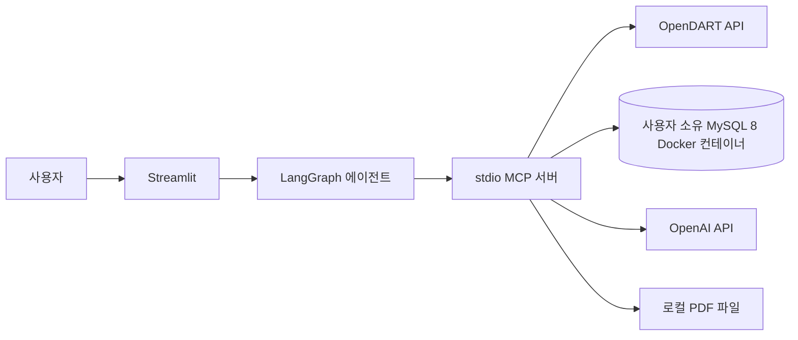

# 실행·환경 설정 안내서

## 1. 프로젝트 실행 구조와 MySQL 경계

이 프로젝트는 Streamlit UI에서 LangGraph 에이전트를 실행하고, 에이전트가 stdio 방식의 MCP 서버를 통해 OpenDART API와 PDF 생성 도구를 호출하는 재무 상담 앱이다. 프로젝트 코드에는 MySQL용 Dockerfile이나 Compose 설정이 없다. 개발자는 프로젝트 외부에서 MySQL 8 Docker 이미지 컨테이너를 실행하고, 호스트에서 실행하는 앱은 컨테이너에 공개된 포트로 접속한다.

MySQL에는 OpenDART 기업 고유번호(CorpCode)와 동기화 이력만 저장한다. 재무제표 응답과 대화 이력은 MySQL에 적재하지 않는다.



## 2. 사전 준비

- Python 3.12 이상
- 프로젝트 외부에서 실행 중인 MySQL 8 컨테이너 및 호스트에 공개된 접속 포트
- OpenAI API 키와 OpenDART API 키
- Docker CLI (MySQL 컨테이너 상태 확인 또는 새 컨테이너 예시를 사용할 때)

저장소에는 MySQL 컨테이너를 관리하는 `Dockerfile`/`docker-compose.yml`이 없다. 공식 MySQL 이미지를 그대로 사용하므로 별도 Dockerfile이나 초기화 스크립트는 필요하지 않다. 아래 컨테이너 생성 명령은 **아직 MySQL이 없고 새 개발용 인스턴스가 필요한 경우에만 참고**한다. 기존 컨테이너를 사용 중이라면 새 인스턴스를 만들거나 기존 컨테이너를 재생성하지 말고 3.1절부터 진행한다.

## 3. MySQL 8 Docker 컨테이너

### 3.1 기존 컨테이너 확인

현재 실행 중인 컨테이너 이름, 이미지 태그, 호스트 포트 공개 상태를 확인한다.

```bash
docker ps --format 'table {{.Names}}\t{{.Image}}\t{{.Ports}}'
docker port <컨테이너_이름> 3306
```

예를 들어 `127.0.0.1:3307->3306/tcp`로 공개되어 있으면, Streamlit을 호스트에서 실행할 때 연결 URL에는 `127.0.0.1:3307`을 사용한다. `3306`은 컨테이너 내부 포트이며, 호스트 포트와 같다고 가정하지 않는다. `docker inspect` 전체 출력에는 환경변수와 비밀번호가 포함될 수 있으니 출력물을 공유하지 않는다.

### 3.2 새 개발용 컨테이너가 필요한 경우에만

아래는 MySQL 8.0 컨테이너를 새로 만들 때의 예다. 컨테이너 이름이나 호스트 포트 `3307`이 이미 사용 중이면 다른 값을 선택한다. 암호를 명령줄에 직접 적지 않도록 저장소 밖의 보호된 경로에 환경 파일을 만든다.

`/secure/path/mysql8.env` 예시:

```dotenv
MYSQL_ROOT_PASSWORD=<강력한-로컬-관리자-비밀번호>
MYSQL_DATABASE=dart
```

파일 권한을 제한한 뒤 영속 볼륨과 컨테이너를 만든다.

```bash
chmod 600 /secure/path/mysql8.env
docker volume create finalproject-mysql8-data
docker run -d \
  --name finalproject-mysql8 \
  --env-file /secure/path/mysql8.env \
  -p 127.0.0.1:3307:3306 \
  -v finalproject-mysql8-data:/var/lib/mysql \
  --restart unless-stopped \
  mysql:8.0
```

호스트 포트를 `127.0.0.1`에만 바인딩해 로컬 개발 호스트에서 접속하도록 하고, MySQL 데이터는 named volume에 보존한다. 컨테이너를 지우더라도 데이터를 유지하려면 볼륨을 삭제하지 않는다.

Docker 공식 MySQL 이미지는 `MYSQL_DATABASE` 등의 초기화 변수를 데이터 디렉터리가 비어 있는 최초 초기화 때 적용한다. 이미 데이터가 들어 있는 볼륨을 연결하면 이 변수만 바꿔도 기존 DB·계정·암호가 변경되지 않는다. `/docker-entrypoint-initdb.d` 초기화 파일도 최초 초기화 때 실행된다. 그러므로 기존 데이터가 있는 컨테이너에 초기화가 필요하다는 이유로 볼륨을 삭제하지 말고, MySQL에 접속해 SQL을 실행한다. [공식 MySQL 이미지 문서](https://hub.docker.com/_/mysql)

## 4. 데이터베이스 및 테이블 준비

### 4.1 컨테이너 안의 MySQL 클라이언트 접속

관리 권한이 있는 계정으로 컨테이너 내부 MySQL 클라이언트를 실행한다. `-p` 뒤에 암호를 붙이지 않으면 입력 프롬프트가 표시된다.

```bash
docker exec -it <컨테이너_이름> mysql -u <관리자_계정> -p
```

DB가 아직 없다면 MySQL 프롬프트에서 생성한다.

```sql
CREATE DATABASE IF NOT EXISTS dart
  CHARACTER SET utf8mb4
  COLLATE utf8mb4_0900_ai_ci;
```

앱에 사용할 DB 계정은 운영 환경의 권한 정책에 따라 DBA가 준비한다. 최초 동기화에서는 대상 DB에 테이블을 생성할 권한이 필요하며, 이후 회사명 검색과 동기화에 필요한 읽기·쓰기 권한도 필요하다. 계정과 암호는 `.env`에만 지정하고 문서나 Git에 기록하지 않는다.

### 4.2 테이블 생성: 앱의 동기화 명령 권장

DB를 먼저 만든 후 프로젝트 루트에서 실행한다.

```bash
(cd src && ../.venv/bin/python -m app.corp_code_sync)
```

이 명령은 `.env`의 OpenDART 키와 `CORP_CODE_DATABASE_URL`을 사용해 CorpCode ZIP을 내려받아 동기화한다. 코드에서 SQLAlchemy `Base.metadata.create_all`을 호출하므로 DB 안에 다음 테이블이 없으면 생성한 뒤 자료를 적재한다.

- `dart_corp_codes`: 기업 고유번호, 기업명, 종목코드 등
- `dart_corp_code_sync_runs`: 원본 해시 및 동기화 건수 이력

따라서 이 명령은 테이블 생성 외에도 외부 OpenDART 호출과 MySQL 쓰기를 수행한다. 이미 동기화가 끝났고 테이블만 만들고 싶은 상황이라면 호출하지 말고 아래의 수동 DDL 절차를 사용한다. `create_all`은 없는 테이블을 만들지만 기존 테이블을 마이그레이션하거나 열 구조를 수정하지 않는다.

### 4.3 테이블 생성: SQL 파일을 수동 적용

MySQL 클라이언트가 설치된 호스트에서 프로젝트 루트 기준으로 적용한다.

```bash
mysql -h 127.0.0.1 -P <공개_호스트_포트> -u <관리자_계정> -p < src/sql/corp_code.sql
```

또는 SQL GUI에서 `src/sql/corp_code.sql` 내용을 MySQL 연결에 실행한다. 이 파일은 `dart` 데이터베이스와 CorpCode 테이블 두 개를 생성한다. 현재 모델과 타입·인덱스 정의가 달라질 수 있으므로 신규 환경에서 가장 정확한 현재 모델 반영 방법은 4.2절의 코드 동기화 명령이다. 기존 테이블을 변경해야 한다면 먼저 백업하고 별도 마이그레이션으로 처리한다.

`src/sql/schema.sql`은 과거 SQLite용 스키마로, MySQL 컨테이너에 적용하지 않는다.

### 4.4 생성 결과 확인

```bash
docker exec -it <컨테이너_이름> mysql -u <DB_계정> -p -D dart -e 'SHOW TABLES;'
```

정상 준비된 DB에는 `dart_corp_codes`, `dart_corp_code_sync_runs`가 보인다. 회사명 검색이 되려면 `dart_corp_codes`에 동기화된 레코드도 존재해야 한다.

## 5. Python 환경과 프로젝트 설정

프로젝트 루트에서 가상환경을 만들고 의존성을 설치한다.

```bash
python3.12 -m venv .venv
source .venv/bin/activate
python -m pip install --upgrade pip
python -m pip install -r src/requirements.txt
```

프로젝트 루트의 `.env`에 다음 항목을 설정한다. 꺾쇠 괄호의 설명은 실제 값으로 바꾼다.

```dotenv
OPENAI_API_KEY=<OpenAI_API_키>
DEFAULT_LLM_MODEL=gpt-5-nano
DART_API_KEY=<OpenDART_API_키>
CORP_CODE_DATABASE_URL=mysql+asyncmy://<DB_USER>:<URL_ENCODED_PASSWORD>@127.0.0.1:<공개_호스트_포트>/dart?charset=utf8mb4
FINANCIAL_REPORT_DIR=src/data/reports
```

코드는 `DART_API_KEY` 또는 `OPENDART_API_KEY`를 읽는다. DB 연결 변수는 `CORP_CODE_DATABASE_URL`이다. URL 안 비밀번호에 `@`, `:`, `/`, `?`, `#` 등이 있다면 URL 인코딩한다. Streamlit이 호스트에서 실행되므로 DB 주소에는 컨테이너 내부 서비스명 대신 `127.0.0.1`과 공개 호스트 포트를 사용한다. `.env`를 Git에 추가하거나 키·암호가 포함된 로그를 공유하지 않는다.

## 6. 앱 실행

프로젝트 루트에서 실행한다.

```bash
source .venv/bin/activate
streamlit run src/app/streamlit_app.py
```

Streamlit이 필요할 때 `src/`를 작업 디렉터리로 stdio MCP 서버를 실행하므로, MCP 서버를 별도 터미널에서 먼저 시작할 필요는 없다. 앱 화면에서 회사와 질문을 입력한다. PDF 생성을 요청하면 기본 경로 또는 `FINANCIAL_REPORT_DIR`에 파일을 만들고 다운로드 버튼을 제공한다.

## 7. 문제 해결

| 증상 | 확인 사항 |
| --- | --- |
| MySQL 연결 거부 | 컨테이너가 실행 중인지, 포트가 호스트에 공개됐는지, URL에 내부 포트가 아니라 공개 호스트 포트가 있는지 확인한다. |
| `Unknown database: dart` | MySQL에 `dart` 데이터베이스를 생성했는지 확인한다. ORM 테이블 생성은 데이터베이스 자체를 만들지 않는다. |
| 테이블 생성 또는 권한 오류 | 최초 동기화 계정에 테이블 생성 권한이 있는지, 일반 동기화에 필요한 데이터 쓰기 권한이 있는지 확인한다. |
| 회사명을 찾지 못함 | CorpCode 동기화가 완료됐는지, 동기화 이력과 테이블 레코드가 있는지 확인한다. |
| MCP 도구를 찾지 못함 | 가상환경 의존성을 설치했는지, 프로젝트 루트에서 Streamlit을 실행했는지 확인한다. |
| OpenAI/OpenDART 인증 오류 | `.env`의 변수 이름과 설정 여부를 확인한다. 실제 키 값은 로그나 채팅에 붙이지 않는다. |

## 8. 관련 문서 및 코드

- [시스템 설계서](system_design.md): 컴포넌트, 데이터 흐름, 시스템 경계
- [요구사항 정의서](requirements_definition.md): 현재 범위와 기능 요구사항
- [데이터·API 설계서](data_api_design.md): 데이터 모델 및 외부 API 흐름
- [테스트 계획 및 결과서](test_plan_and_results.md): 이전 실행 기록과 저장소의 테스트 방법
- [생명주기 설명서](lifecycle.md): 현재 연결 생명주기와 개선 논의
- [문제점 기록](problem.md): 확인된 구현 문제와 후속 개선 후보
- [실행 의존성](requirements.txt)
- [CorpCode 동기화 모듈](app/corp_code_sync.py)
- [MySQL DDL](sql/corp_code.sql)
- [SQLite 레거시 DDL](sql/schema.sql)
