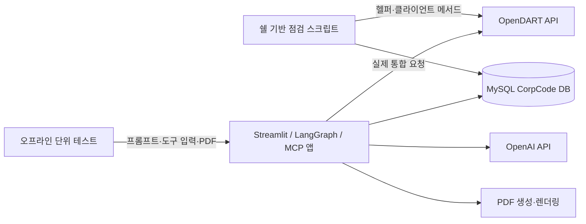

# 테스트 계획 및 결과서

## 1. 목적과 결과 해석 기준

이 문서는 OpenDART 재무 상담 프로젝트의 오프라인 단위 테스트, 쉘 기반 OpenDART 점검, 실제 API·에이전트 통합 결과를 한곳에 정리한다. 이전 대화에서 수행한 라이브 API 검증과 현재 저장소에 있는 테스트 스크립트를 모두 다루되, **이전 실행 기록**, **스크립트에 정의된 검사**, **이번 문서 작업에서 다시 실행한 검사**를 서로 구분한다.

현재 저장소에는 테스트 결과 로그 파일이 없다. 과거 결과는 이전 작업 기록을 바탕으로 요약했으며, 전체 원본 터미널 출력을 재현할 수 있는 상태는 아니다. 아래 `이전 기록 PASS`는 과거 기록상의 결과이지, 현재 환경에서 재실행한 결과를 뜻하지 않는다.

## 2. 테스트 대상과 경계



| 테스트 계층 | 주 목적 | 실제 외부 환경 사용 |
|---|---|---|
| 단위 테스트 | 프롬프트, 입력 검증, 도구 직렬화, PDF 파일 생성의 오프라인 동작 | 없음. 모델과 파일 디렉터리를 대체하거나 임시 디렉터리를 사용 |
| `test_callImportant.sh` | 순수 함수와 OpenDART 클라이언트의 여러 API 경로를 점검 | 있음. API 키와 네트워크가 필요하며 회사명 조회에는 CorpCode MySQL도 필요 |
| `show_callImportant_result.sh` | 실제 회사 재무 조회 결과를 JSON으로 확인 | 있음. OpenDART와 CorpCode MySQL 필요. 테스트 판정기라기보다 결과 확인용 |
| 에이전트 종단 간 검증 | MCP 재무 응답을 모델에 전달하고 답변이 생성되는지 확인 | OpenDART·OpenAI API 및 MCP 실행 환경 사용 |
| PDF 시각 검토 | 실제 크기·한글·여러 페이지·지표 카드 배치 확인 | PDF 렌더링 도구 사용. 외부 API는 필요하지 않음 |

## 3. 현재 저장소의 테스트 자산

### 3.1 오프라인 단위 테스트

파일: [`tests/test_financial_chatbot.py`](tests/test_financial_chatbot.py)

현재 7개 테스트 메서드는 다음 경계를 확인하도록 작성되어 있다.

1. 네 가지 재무 이해 수준 프롬프트가 서로 다르고 필수 도구 안내를 포함한다.
2. 지원하지 않는 설명 수준은 거절한다.
3. 가짜 ChatOpenAI로 LangGraph 에이전트의 모델 초기 설정과 응답 흐름을 확인한다.
4. 재무 조회 MCP 도구가 입력 인자를 서비스 함수에 전달하고 JSON 직렬화 결과를 돌려준다.
5. 잘못된 `history_count`와 `fs_div` 입력을 거절한다.
6. PDF 파일 생성, 한글·출처 텍스트, 다운로드 토큰을 확인한다.
7. 회사명이 비어 있으면 PDF 생성이 실패하고 파일을 남기지 않는다.

테스트 파일은 외부 API 호출 없이 동작하도록 모델 함수를 대체하며 PDF는 임시 디렉터리에 생성한다.

### 3.2 `test_callImportant.sh`

파일: [`test_callImportant.sh`](test_callImportant.sh)

이 스크립트는 순수 함수와 실제 서비스를 같은 실행에서 확인한다.

- **헬퍼 검사:** API 키 설정 여부, 기업코드·보고서 파라미터 검증, 보고서명 및 사업연도 해석, 숫자 변환, 출처 메타데이터, 계정·지표 정규화, API 오류 래퍼
- **실제 API 검사:** JSON·ZIP 저수준 요청, `corpCode.xml`, 회사명→CorpCode DB 조회, 기업 개황, 공시 검색, 정기보고서, 주요계정, 주요지표, 전체 재무제표, 공시 원문, 다중회사 비교, XBRL 택사노미·파일, 통합 재무자료 진입점
- 결과 상태는 `PASS`, `FAIL`, `SKIP`, `NO DATA`로 요약한다. 예외 문자열과 요청 URL을 그대로 출력하지 않도록 작성돼 있다.
- 최신 정기보고서가 없으면 그 보고서를 인자로 요구하는 후속 검사는 `SKIP`으로 기록한다.

실행 예시:

```bash
bash src/test_callImportant.sh \
  --company-name "삼성전자" \
  --corp-code 00126380 \
  --history-count 1
```

사전 조건은 프로젝트 가상환경 의존성, 프로젝트 루트 `.env`의 OpenDART 키, 접속 가능한 MySQL 데이터베이스와 동기화된 CorpCode 테이블, 외부 네트워크다. 이 스크립트는 실제 OpenDART API를 호출하고 DB에 연결하므로 순수 오프라인 테스트가 아니다.

### 3.3 `show_callImportant_result.sh`

파일: [`show_callImportant_result.sh`](show_callImportant_result.sh)

이 스크립트는 회사명으로 재무자료를 조회해 전체 JSON을 stdout에 출력한다. 성공/실패 테스트 요약이나 기대 결과 비교를 수행하는 자동 테스트는 아니다. 요청 URL의 인증키는 반환 JSON에 넣지 않도록 작성돼 있지만, **회사 재무자료 전체가 출력되므로** 터미널 로그·공유 캡처에 그대로 남기지 않는다.

실행 예시:

```bash
bash src/show_callImportant_result.sh "삼성전자" --history-count 1 --fs-div CFS
```

## 4. 테스트 계획

| ID | 검사 | 실행/검증 방법 | 기대 결과 |
|---|---|---|---|
| TP-01 | 오프라인 단위 테스트 | ` .venv/bin/python -m unittest discover -s src/tests -p 'test_*.py' ` | 현재 작성된 7개 테스트가 모두 통과하고 외부 API 요청이 발생하지 않음 |
| TP-02 | 쉘 헬퍼 검사 | `bash src/test_callImportant.sh` 실행의 헬퍼 단계 | 입력 검증·보고서 해석·숫자·출처 정규화가 PASS |
| TP-03 | MySQL CorpCode 통합 | 쉘 검사에서 회사명 lookup을 실행 | 등록된 회사는 단일 `corp_code`로 resolve되고 DB 연결 실패는 별도 실패로 표시 |
| TP-04 | OpenDART 엔드포인트 통합 | 쉘 검사에서 API별 status·응답 형태를 확인 | 성공은 `status=000`; 데이터 없음은 `NO DATA`; 인증·파라미터·네트워크 오류는 FAIL로 식별 |
| TP-05 | 과거 보고서 및 정정본 처리 | 보고서 검색 결과를 다수 페이지·정정공시 사례와 비교 | 원하는 과거 보고서를 누락하지 않고 동일 보고서의 정정본 선택 정책이 일관됨 |
| TP-06 | 금액 정규화 | 원본 JSON의 재무제표 종류·보고서 코드별 금액 필드와 정규화 결과 비교 | 기간·단위가 맞는 값만 선택하고, 결측을 0으로 바꾸지 않음 |
| TP-07 | 에이전트 종단 간 | 실제 MCP 조회 결과로 OpenAI 응답 생성 | 답변의 숫자·기준·출처가 조회 자료에 있고 확인되지 않은 값을 만들지 않음 |
| TP-08 | PDF 기능·시각 검토 | 단일/장문 보고서 생성 후 모든 페이지 텍스트 추출·렌더링 | 한글·지표·출처 표시, 줄바꿈·페이지 번호·경계가 정상이고 다운로드 파일이 존재 |
| TP-09 | 인증키 로그 보호 | 실제 요청 시 터미널 및 애플리케이션 로그에서 인증 URL 검색 | `crtfc_key`, OpenAI 키, DB 비밀번호가 로그에 남지 않음 |
| TP-10 | 동시 사용자 및 연결 수명 | 반복·동시 재무 조회 동안 DB 연결 수와 요청 시간을 측정 | 합의된 성능 한도 내에서 동작하며 종료 후 연결이 정리됨 |

TP-05, TP-07, TP-09, TP-10은 현재 쉘 스크립트만으로 완전히 검증되지 않는다. 별도 통합·부하·보안 검증이 필요하다.

## 5. 이전 테스트 결과

아래는 이전 대화에서 실행한 테스트에 대한 기록이다. 현재 이 문서를 만드는 동안 해당 API나 DB를 다시 호출하지 않았다.

| ID | 시점·범위 | 기록된 결과 | 판정과 제한 |
|---|---|---|---|
| TR-01 | 2026-09-22, OpenDART API 점검 | 날짜 검색 조건을 조정한 뒤 주요 재무 API 등 13개 검사 중 11개 엔드포인트가 성공. 단일 주요계정, 네 분류 재무지표, 전체 재무제표, 다중회사 주요계정, XBRL 택사노미·XBRL ZIP 응답을 확인했다. | **부분 통과.** `fnlttCmpnyIndx.json`은 필수 `stacnt_code`, `idx_cl_code` 누락으로 실패했고, `document.json`은 유효하지 않은 경로였다. 이후 코드에서 다중 지표 필수 인자를 추가하고 원문 조회는 `document.xml`을 우선하도록 수정했다. 수정 후 전체 스크립트의 13개 경로가 모두 통과했다는 결과는 확인되지 않았다. |
| TR-02 | 2026-09-22, 재무자료 통합 조회 | CorpCode에서 회사명을 해석하고 정기보고서·기업 개황·5종 재무제표·4개 지표 분류를 포함한 데이터 패키지를 반환했다. | **통합 조회 통과 기록.** 당시 실제 회사·보고서의 성공 사례이며 모든 기업·기간을 보장하지 않는다. |
| TR-03 | 2026-09-23, OpenDART→MCP→OpenAI 종단 간 | 실제 OpenDART 응답을 MCP 도구로 가져와 모델에 제공했고, 모델이 출처·연결 기준·공시일·반기 누적치 주의사항을 포함한 요약을 만들었다. | **종단 간 통과 기록.** 해당 요청 조건의 응답 생성 결과다. PDF 생성은 요청에서 제외했으므로 PDF 경로의 결과는 아니다. |
| TR-04 | 2026-09-23, 재무자료 정규화 | 반기 연결 현금흐름표 39개 항목에 원본 `thstrm_amount`가 있었지만 현재 선택하는 `thstrm_add_amount`는 없음을 확인했다. | **결함 발견.** 이 조건의 현금흐름 금액이 정규화 결과에서 사용 불가가 될 수 있으며 `problem.md`에 기록돼 있다. 후속 코드에서 필드 선택을 수정한 뒤 재검증했다는 기록은 확인되지 않았다. |
| TR-05 | 2026-09-23, OpenDART 요청 로그 | HTTP 요청 URL 로그에 `crtfc_key` 쿼리 값이 출력되는 사례를 확인했다. | **보안 결함 발견.** 원시 로그를 외부 공유하지 말고, 마스킹을 적용한 뒤 재검증해야 한다. |
| TR-06 | 2026-09-23, PDF 생성 시각 검토 | 한 페이지 PDF와 9개 지표를 포함한 장문 다중 페이지 PDF를 만들고 렌더링해 한글 폰트, 지표 카드, 페이지 흐름과 경계를 확인했다. | **레이아웃 검토 통과 기록.** 특정 표본 데이터에서의 시각 검토이며 다양한 실제 응답에 대한 회귀 검증은 별도다. |

### 결과 해석 메모

- TR-01의 11/13은 수정 전 부분 결과다. 이후 개별 경로 수정·확인은 있으나, 이 결과만으로 전체 OpenDART 스크립트의 현행 성공률을 산정하지 않는다.
- TR-02·TR-03은 실제 단일 기업·보고서 중심 성공 사례다. 모든 기업, 모든 보고서 코드, 과거 이력 전체에서 동일한 결과를 보장하지 않는다.
- TR-04와 TR-05는 테스트 실패라기보다 테스트에서 발견된 데이터 정확성·보안 결함이며, 해결 확인 전까지 열린 항목이다.
- 저장소의 `src/test_callImportant.sh`는 개별 실행 결과 로그를 파일로 남기지 않는다. 향후 테스트 결과를 계획적으로 보존하려면 요약 파일에 날짜, 커밋, PASS/FAIL/SKIP 수, API 상태 코드만 기록하고 원본 응답과 비밀값은 기록하지 않는다.

## 6. 현재 미확인 결과와 실행 상태

이번 보고서 작성 시점에 테스트 명령과 외부 API 호출은 실행하지 않았다. 따라서 다음 항목은 현행 커밋에서 미확인이다.

- `tests/test_financial_chatbot.py`의 7개 테스트 실행 결과
- 현재 `test_callImportant.sh`로 수행한 전체 라이브 API 재검증 결과
- MySQL 8 Docker 컨테이너와 현재 `.env` 연결 문자열 간의 실시간 접속 결과
- 앞선 API 수정 이후 13개 엔드포인트 전체 회귀 결과
- PDF 수치와 OpenDART 원본 사이의 자동 대조
- 요청 로그에서 OpenDART 인증키 마스킹 완료 여부
- 동시 요청 시 MySQL 엔진·연결 수와 응답시간

## 7. 권장 실행 순서

1. `.venv`와 비밀값 없는 실행 설정을 확인한다.
2. MySQL 8 컨테이너가 실행 중인지와 CorpCode DB 연결을 먼저 확인한다.
3. 오프라인 테스트를 실행한다.

   ```bash
   .venv/bin/python -m unittest discover -s src/tests -p 'test_*.py'
   ```

4. 실제 API 호출에 승인된 환경에서 `test_callImportant.sh`를 실행한다.

   ```bash
   bash src/test_callImportant.sh --company-name "삼성전자" --corp-code 00126380 --history-count 1
   ```

5. 스크립트 요약에서 `FAIL`, `SKIP`, `NO DATA`를 구분한다. `NO DATA`는 자동으로 성공이나 실패로 바꾸지 말고 해당 API와 조건을 확인한다.
6. API 결과가 정상일 때 실제 MCP 에이전트 요청을 검증하고, 마지막으로 PDF를 생성·렌더링한다.
7. 결과 기록에는 커밋 해시, 실행 환경, 테스트 명령, 상태별 개수, 수정된 결함을 남긴다. 인증키, DB URL, 전체 회사 재무 JSON은 남기지 않는다.

## 8. 관련 파일

- [`test_callImportant.sh`](test_callImportant.sh): 헬퍼 검사와 OpenDART·CorpCode 라이브 통합 점검
- [`show_callImportant_result.sh`](show_callImportant_result.sh): 실제 재무자료 전체 JSON 확인용 스크립트
- [`tests/test_financial_chatbot.py`](tests/test_financial_chatbot.py): 오프라인 프롬프트·에이전트·MCP·PDF 단위 테스트
- [`problem.md`](problem.md): 테스트에서 발견된 문제와 보완 방향
- [`data_api_design.md`](data_api_design.md): API·데이터 계약
- [`run_environment_guide.md`](run_environment_guide.md): 앱·MySQL 환경 준비와 실행
