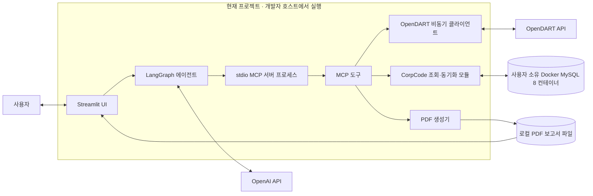
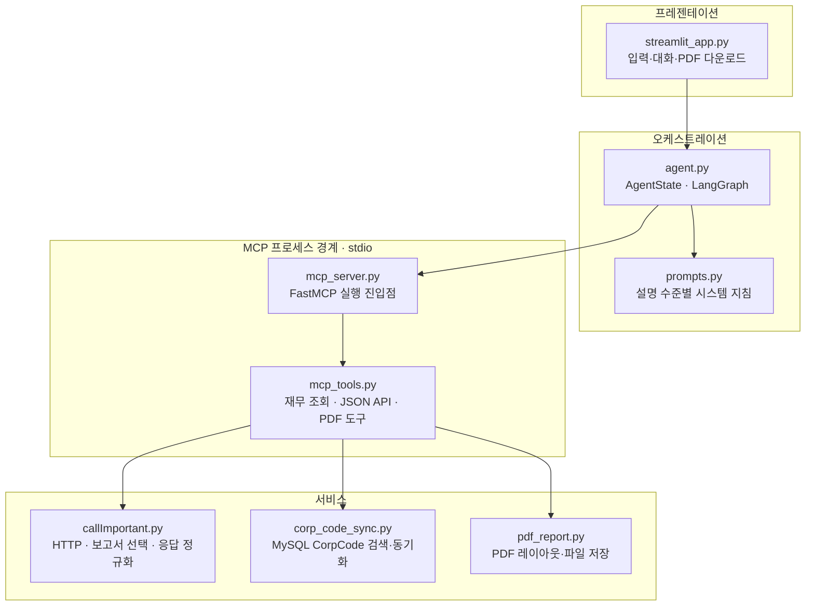
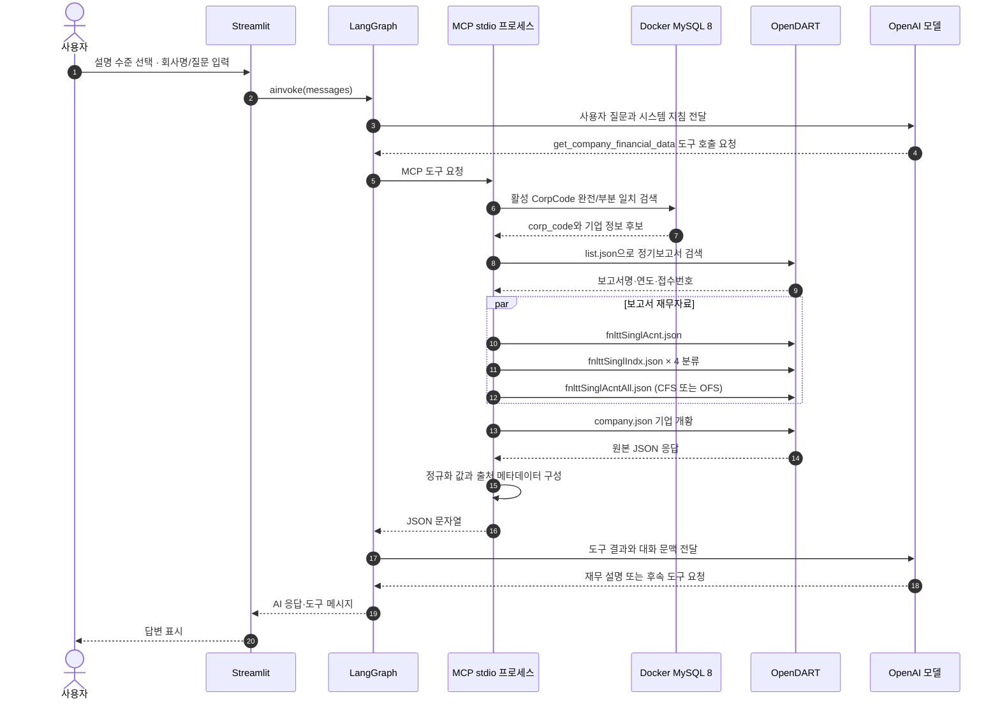
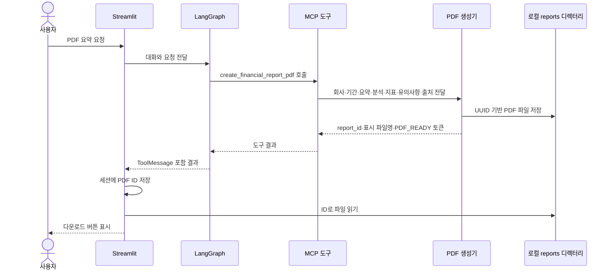
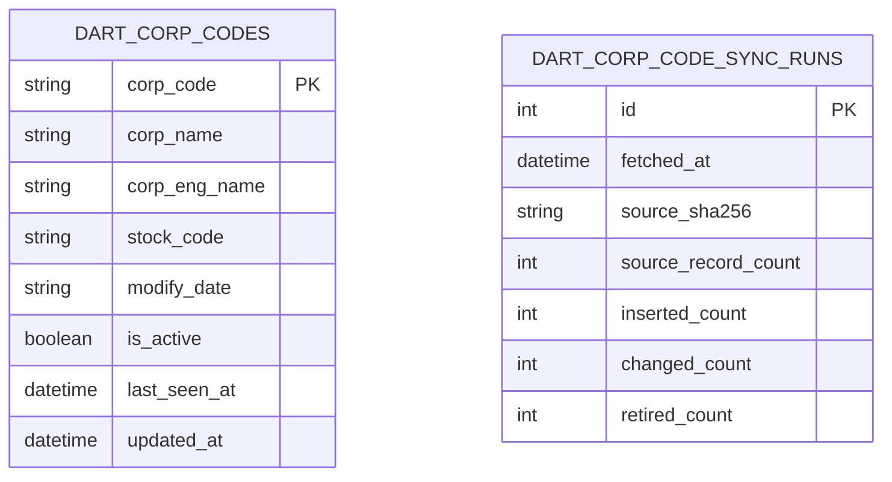

# OpenDART 재무 상담 앱 시스템 설계서

## 1. 문서 목적과 기준

현재 저장소의 코드와 디렉터리 구조를 기준으로 시스템 경계, 주요 모듈, 실행 시 데이터 흐름, 저장 구조, 운영 의존성을 설명한다. 문서의 다이어그램은 **현재 구현**을 나타낸다. 후속 개선안은 현재 구조와 혼동되지 않도록 별도 표기한다.

현재 앱의 중심 경로는 Streamlit → LangGraph → stdio MCP → OpenDART 조회 → 모델 응답이다. MySQL은 DART CorpCode를 찾고 동기화하는 데 사용한다. 재무 조회 결과는 MySQL에 적재하지 않는다.

## 2. 시스템 컨텍스트



### 실행·소유 경계

- Streamlit, LangGraph, MCP stdio 프로세스는 현재 개발 환경에서 실행된다.
- MySQL 8 Docker 컨테이너는 프로젝트 안에 정의되지 않았으며 개발자가 별도로 실행·관리한다. 프로젝트에는 MySQL 컨테이너용 Dockerfile이나 Compose 구성이 없다.
- OpenDART와 OpenAI는 외부 HTTPS 서비스다.
- PDF 파일은 기본적으로 `src/data/reports/`의 로컬 파일 시스템에 저장된다.

## 3. 구성요소와 책임



| 모듈 | 책임 | 주요 입출력 |
|---|---|---|
| `app/streamlit_app.py` | 설명 수준 선택, 대화 메시지 표시, 사용자 입력, 생성된 PDF 다운로드 | 사용자 텍스트 ↔ UI 상태·답변·PDF 파일 |
| `app/agent.py` | LangGraph 상태와 에이전트·도구 분기 구성, MCP stdio 연결 | `AgentState.messages` ↔ LLM/MCP 도구 |
| `app/prompts.py` | 설명 수준과 재무 응답 지침 구성 | 수준 ID → 시스템 프롬프트 |
| `app/mcp_server.py` | FastMCP를 stdio 전송으로 실행하는 진입점 | MCP JSON-RPC 요청·응답 |
| `app/mcp_tools.py` | 모델에 노출할 도구 계약과 입력 검증 | 문자열/JSON 입력 → 조회 JSON 또는 PDF 토큰 |
| `app/callImportant.py` | OpenDART HTTP 호출, 보고서 조회, 응답 정규화 및 메타데이터 결합 | JSON/ZIP API 응답 → Python 자료구조 |
| `app/corp_code_sync.py` | CorpCode ZIP 파싱, MySQL 엔진·세션, 기업명 검색·동기화 | 회사명·동기화 명령 ↔ MySQL |
| `app/pdf_report.py` | 페이지·한글 폰트·요약·지표 카드·출처를 PDF로 구성 | 보고서 필드 → 로컬 PDF 및 다운로드 토큰 |

## 4. 런타임 요청 흐름

### 4.1 재무 상담



OpenDART API 요청에는 인증키가 쿼리 파라미터로 전달된다. 인증키 환경변수의 우선순위와 데이터 계약은 [`data_api_design.md`](data_api_design.md)에 상세히 적었다.

### 4.2 PDF 생성과 다운로드



기본 저장 디렉터리는 `src/data/reports/`이며 `FINANCIAL_REPORT_DIR`로 바꿀 수 있다. PDF 생성은 모델이 전달한 내용의 배치 작업이다. 현재 자동으로 원본 재무 JSON과 PDF 수치를 대조하지 않는다.

## 5. 디렉터리 구조

아래는 애플리케이션 소스·설계 문서 중심의 구조다. `.venv`, `__pycache__`, Graphify 출력, IDE 설정 및 실제 데이터 파일은 생략했다.

```text
finalproject/
├── .env                         # 로컬 비밀 설정, Git 제외
├── src/
│   ├── app/
│   │   ├── streamlit_app.py     # UI 진입점
│   │   ├── agent.py             # LangGraph·MCP 클라이언트
│   │   ├── prompts.py           # 재무 상담 지침
│   │   ├── mcp_server.py        # stdio MCP 서버 진입점
│   │   ├── mcp_tools.py         # 모델 도구 인터페이스
│   │   ├── callImportant.py     # OpenDART API·정규화
│   │   ├── corp_code_sync.py    # MySQL CorpCode 저장·검색·동기화
│   │   └── pdf_report.py        # PDF 파일 생성
│   ├── sql/
│   │   ├── corp_code.sql        # MySQL CorpCode 스키마 참고
│   │   └── schema.sql           # 구형 SQLite용 스키마, 현재 앱 비대상
│   ├── tests/
│   │   └── test_financial_chatbot.py # 오프라인 단위 테스트
│   ├── data/                    # 로컬 런타임·사용자 데이터
│   │   └── reports/             # 생성된 PDF
│   ├── APIList.md               # OpenDART API 참고
│   ├── ImportantList.md         # 재무보고 수집 API 선정
│   ├── README.md                # 앱 개요·간단 실행법
│   ├── requirements.txt         # Python 의존성
│   ├── data_api_design.md       # 데이터·API 설계
│   ├── requirements_definition.md # 요구사항 정의
│   ├── lifecycle.md              # MySQL·MCP 연결 수명주기
│   ├── problem.md                # 현재 문제 기록
│   ├── run_environment_guide.md  # 실행·환경 설정 안내
│   ├── test_callImportant.sh     # 헬퍼·라이브 API 점검
│   ├── show_callImportant_result.sh # 실제 재무 JSON 확인
│   └── test_plan_and_results.md  # 테스트 계획·결과
└── [프로젝트 외부에서 실행 중인 MySQL 8 Docker 컨테이너]
```

`src/data/chroma/`와 `src/data/proposals/` 같은 로컬 데이터 디렉터리도 디스크에 존재할 수 있다. 현재 재무 상담 앱은 해당 Chroma·제안 예시 기능을 실행 경로에서 사용하지 않는다.

## 6. 데이터 저장 구조



두 테이블 사이에 ORM 외래키 관계는 없다. `dart_corp_codes`는 회사 식별을 위한 마스터이며 `dart_corp_code_sync_runs`는 전체 스냅샷 단위의 동기화 이력을 가진다. 재무 계정, 지표, 사용자, 대화 이력을 저장하는 테이블은 현재 앱 모델에 없다.

| 데이터 | 저장 위치 | 수명 |
|---|---|---|
| CorpCode 마스터·동기화 요약 | 개발자가 관리하는 MySQL 8 컨테이너 | 컨테이너의 기존 DB 데이터 수명 |
| OpenDART 재무 조회 원본·정규화 결과 | MCP 도구 결과 및 에이전트 메모리 | 현재 요청·Streamlit 세션 처리 중 |
| 대화 기록 | Streamlit `session_state` | 현재 브라우저 세션 상태 |
| PDF | 로컬 `src/data/reports/` 또는 설정 경로 | 파일 삭제 시까지 |

## 7. 연결 설정과 실행 토폴로지

- `OPENAI_API_KEY`: OpenAI 모델 인증
- `DART_API_KEY` 또는 `OPENDART_API_KEY`: OpenDART 인증
- `CORP_CODE_DATABASE_URL`: MySQL CorpCode 연결 문자열
- `DEFAULT_LLM_MODEL`: 선택 모델(미설정 시 코드 기본값)
- `FINANCIAL_REPORT_DIR`: 선택 PDF 경로

Streamlit은 `.env`의 프로젝트 루트 경로를 읽는다. MCP 도구 프로세스는 Python 인터프리터로 `python -m app.mcp_server`를 stdio 방식으로 실행하며, 작업 디렉터리는 `src/`다. 호스트에서 앱을 실행할 때 `CORP_CODE_DATABASE_URL`은 Docker가 호스트에 게시한 포트로 연결해야 한다. 상세 절차는 [`run_environment_guide.md`](run_environment_guide.md)를 참고한다.

## 8. 주요 설계 제약과 개선 방향

| 현재 구조 또는 제한 | 영향 | 후속 방향 |
|---|---|---|
| 도구 호출용 MCP stdio 세션이 요청마다 생성될 수 있고 CorpCode 조회마다 DB 엔진을 만들고 폐기함 | MySQL 커넥션 풀이 요청 간 공유되지 않아 반복 생성 비용이 생김 | 지속 실행 MCP 서버와 서버 수명 DB 엔진을 평가하고 연결 수·지연을 측정 |
| 공시 검색은 첫 100건만 조회 | 필요한 과거 보고서가 해당 페이지 밖이면 누락 가능 | 필요한 보고서를 얻을 때까지 페이지를 조회하되 상한 적용 |
| `history_count` 최대값 미설정 | 호출 수와 모델 컨텍스트 크기가 커질 수 있음 | 제품 정책에 맞는 최대 보고서 수 및 동시 요청량 설정 |
| 반기 현금흐름 금액 필드 선택 결함 기록 | 정규화 결과에 현금흐름 수치가 누락될 수 있음 | 보고서·재무제표별 필드 규칙과 기간 의미를 검증 |
| PDF에 들어갈 수치의 원본 대조가 자동화되지 않음 | 레이아웃 생성 성공이 수치 정확성을 보장하지 않음 | PDF 생성 전 출처·값·단위·기간 검증 단계 추가 |
| OpenDART 인증 URL이 HTTP 로그에 노출된 사례 기록 | 로그 접근자에게 인증키가 보일 수 있음 | 요청 로그 마스킹 및 회귀 검사 |
| 일반 JSON API 도구가 엔드포인트 허용 목록을 강제하지 않음 | 모델이 넓은 범위의 API 파일명을 요청할 수 있음 | 제품 기능에 필요한 엔드포인트 allowlist 적용 |
| 로컬 PDF 경로의 파일 보존·접근 정책 미정 | 여러 사용자 환경에서 파일 접근 범위·용량 관리가 불분명 | 저장 위치, 파일 보존 기간, 사용자별 접근 제어 결정 |

상세 근거와 확인된 문제는 [`problem.md`](problem.md), 연결 수명주기는 [`lifecycle.md`](lifecycle.md)에 기록되어 있다. 위 개선안은 현재 구현이 아니라 후속 설계 항목이다.

## 9. 확인에 사용한 저장소 자료

- [`README.md`](README.md)와 현재 `src/app` 코드
- [`data_api_design.md`](data_api_design.md)
- [`requirements_definition.md`](requirements_definition.md)
- [`lifecycle.md`](lifecycle.md)
- [`problem.md`](problem.md)
- [`tests/test_financial_chatbot.py`](tests/test_financial_chatbot.py)
- [`sql/corp_code.sql`](sql/corp_code.sql), [`sql/schema.sql`](sql/schema.sql)
